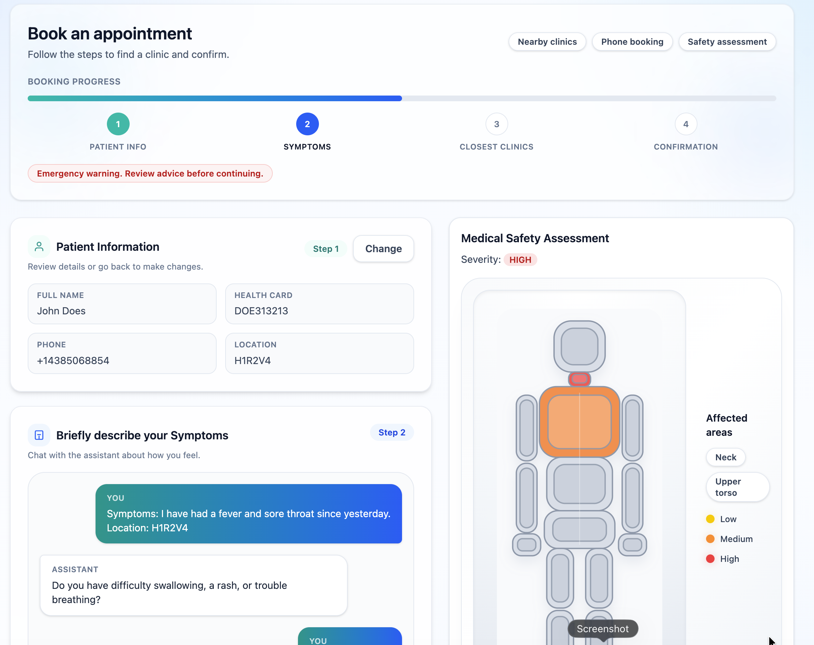
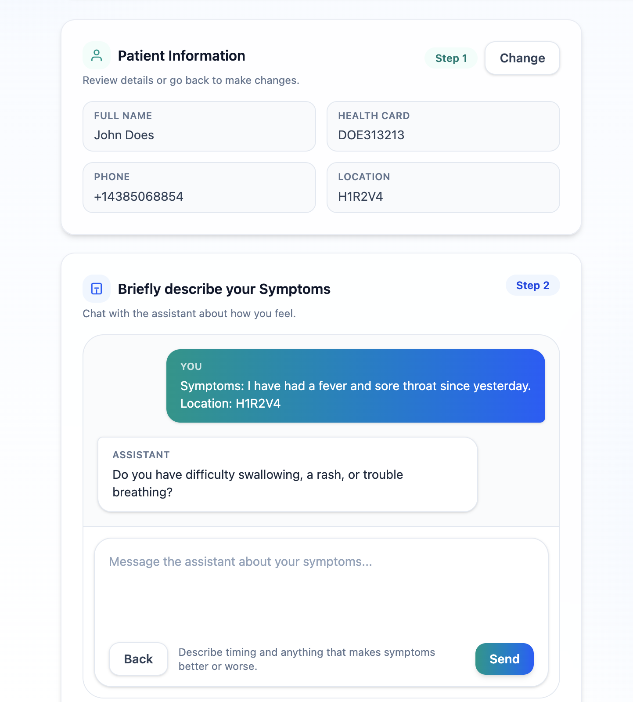
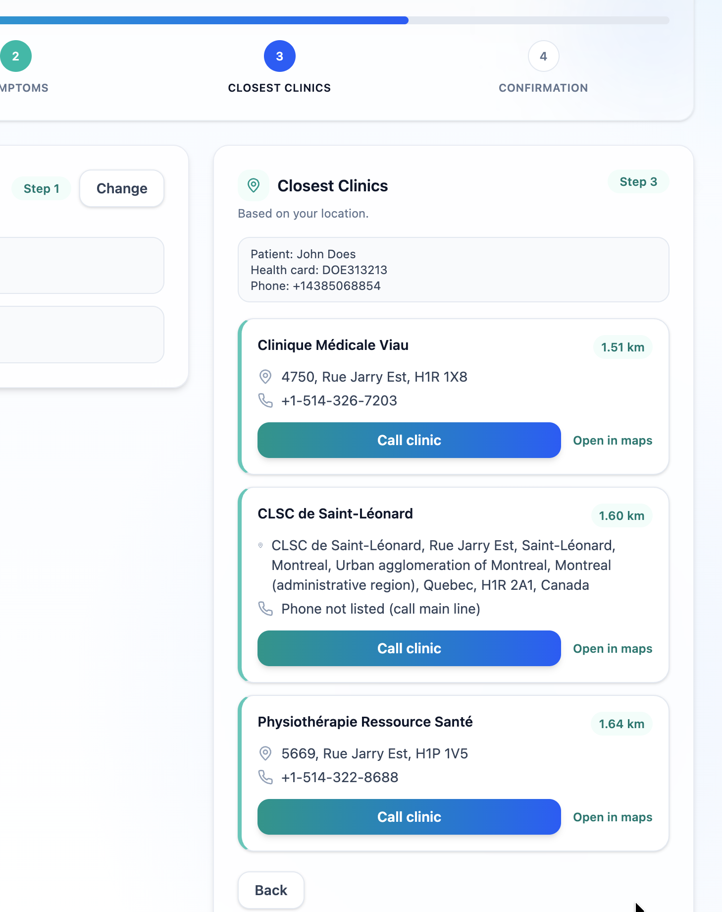
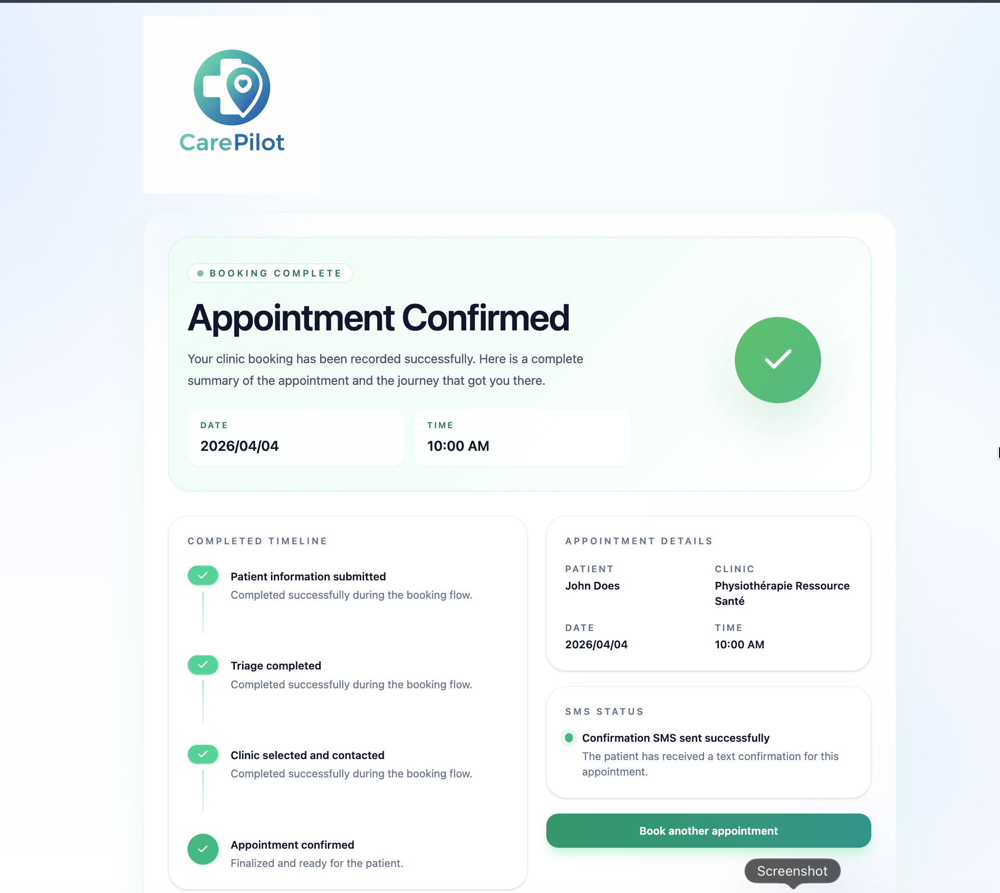

# CarePilot

AI-powered healthcare triage & booking assistant



---

## 🚀 Overview

CarePilot turns patient symptoms into **triaged guidance and real clinic bookings** — in a single seamless flow.

Instead of leaving users to guess where to go, CarePilot:
- understands symptoms through conversational AI
- assesses urgency using grounded medical context
- routes patients to appropriate care
- completes booking through an automated phone call

---

## ✨ What It Does

- 🧠 Conversational symptom triage (Claude + lightweight RAG)
- ⚠️ Urgency classification (`LOW`, `MEDIUM`, `HIGH`)
- 🗺️ Smart routing to nearby clinics
- 📞 Automated outbound booking via Twilio voice
- 📡 Live call transcript streamed to the UI
- 📩 SMS confirmation after booking
- 🎯 Visual triage output with body heatmap

---

## 🖼️ Screenshots

### Triage 


### Choosing Clinic based on location 


### Appointment Confirmation


---

## 🔄 End-to-End User Flow

1. Enter patient information and location  
2. Chat with Claude for symptom triage  
3. Receive urgency level + recommendations + heatmap  
4. Continue to clinic search  
5. Start automated booking call  
6. Watch live call transcript in real-time  
7. Receive appointment confirmation  
8. Receive SMS confirmation (if available)

---

## 🧠 Core System Design

CarePilot is built around a **triage-first architecture**:

- AI does not immediately route users to booking
- Instead, it performs structured triage first
- Booking is gated behind understanding urgency

This ensures:
- safer routing decisions  
- reduced unnecessary emergency visits  
- better patient confidence  

---

## 🧬 Conversational Triage Engine

### Flow

1. User submits symptoms  
2. Backend retrieves relevant medical triage context  
3. Claude receives:
   - full conversation
   - retrieved medical excerpts  
4. Claude returns:
   - urgency level  
   - recommendations  
   - wait-care guidance  
   - emergency warnings  

---

## 📚 Lightweight RAG Layer

CarePilot uses a **Retrieval-Augmented Generation (RAG)** approach to ground medical responses.

### Design Principles

- No heavy vector database
- No full-document injection
- Context retrieved only when relevant
- Claude retains primary reasoning role

### Benefits

- Improved accuracy of triage responses  
- More consistent recommendations  
- Better grounding in medical guidance  
- Safer handling of edge cases  

---

## 🏥 Clinic Routing

- Uses OpenStreetMap (Nominatim + Overpass)  
- Finds nearby clinics based on user location  
- Graceful fallback when live lookup fails  
- Explicit user confirmation before booking  

---

## 📞 Automated Booking System

CarePilot integrates with **Twilio Voice** to automate appointment booking.

### Call Flow

- Confirms availability  
- Handles earliest available fallback  
- Captures appointment time  
- Verifies patient details  

### Live Features

- Real-time transcript streamed to UI  
- On-screen call monitoring  
- Booking timeline visualization  

---

## 📩 Confirmation System

After booking:

- Appointment is stored in memory  
- SMS confirmation is attempted via Twilio  
- UI displays:
  - appointment details  
  - booking timeline  
  - SMS delivery status  

---

## 🎨 UX Highlights

- Chat-style triage interface  
- Persistent multi-step navigation  
- Visual urgency feedback via heatmap  
- Live call monitoring panel  
- Polished confirmation experience  

---

## ⚙️ Tech Stack

- **Frontend:** Next.js 16, React 19, TypeScript, Tailwind CSS  
- **AI:** Anthropic Claude API  
- **Retrieval:** Lightweight RAG-style context injection  
- **Voice & Messaging:** Twilio  
- **TTS (optional):** ElevenLabs  
- **Maps & Clinics:** OpenStreetMap (Nominatim + Overpass)  


## 🧪 Running Locally

### 1. Navigate to app

```bash
cd clinic-assistant-mvp
```

### 2. Install dependencies

```bash
npm install
```

### 3. Create `.env.local`

Add this file at:

`clinic-assistant-mvp/.env.local`

Example:

```env
TWILIO_ACCOUNT_SID=ACxxxxxxxxxxxxxxxxxxxxxxxxxxxxxxxx
TWILIO_AUTH_TOKEN=xxxxxxxxxxxxxxxxxxxxxxxxxxxxxxxx
TWILIO_PHONE_NUMBER=+1xxxxxxxxxx

PUBLIC_BASE_URL=https://your-ngrok-subdomain.ngrok-free.dev

ANTHROPIC_API_KEY=sk-ant-...

ELEVENLABS_API_KEY=sk_...
ELEVENLABS_VOICE_ID=...
ELEVENLABS_MODEL_ID=eleven_flash_v2_5
```

Notes:

- `ANTHROPIC_API_KEY` is required for triage
- `PUBLIC_BASE_URL` must be publicly reachable by Twilio
- ElevenLabs variables are optional if you want to fall back to Twilio voice
- `.env.local` is ignored by git and should not be committed

### 4. Start the app

```bash
npm run dev
```

By default Next will try port `3000`.

### 5. Start ngrok for Twilio callbacks

In another terminal:

```bash
ngrok http 3000
```

Then set:

```env
PUBLIC_BASE_URL=https://your-current-ngrok-domain.ngrok-free.dev
```

Restart `npm run dev` after changing `.env.local`.

## 🧪Local Test Flow

1. Start app + ngrok
2. Enter patient info + symptoms
3. Complete triage conversation
4. Continue to clinic search
5. Start booking call
6. Answer phone and observe flow
7. Verify confirmation page + SMS

## Key Files

- `clinic-assistant-mvp/src/app/page.tsx`
- `clinic-assistant-mvp/src/app/confirmation/page.tsx`
- `clinic-assistant-mvp/src/app/api/triage/route.ts`
- `clinic-assistant-mvp/src/app/api/clinics/route.ts`
- `clinic-assistant-mvp/src/app/api/call/route.ts`
- `clinic-assistant-mvp/src/app/api/call/transcript/route.ts`
- `clinic-assistant-mvp/src/app/api/twilio/voice/route.ts`
- `clinic-assistant-mvp/src/app/api/appointment/confirm/route.ts`
- `clinic-assistant-mvp/src/app/components/body-heatmap.tsx`
- `clinic-assistant-mvp/PROJECT_LOG.md`

## Current Limitations

- Appointment storage is in memory only
- Local Twilio development still depends on ngrok
- Clinic lookup can fall back when OpenStreetMap services are slow or unavailable
- Claude triage still depends on Anthropic availability and rate limits

## Disclaimer

CarePilot does not provide diagnosis or replace professional medical judgment.

If symptoms are severe, unsafe, or rapidly worsening, patients should seek emergency care immediately or call emergency services.
